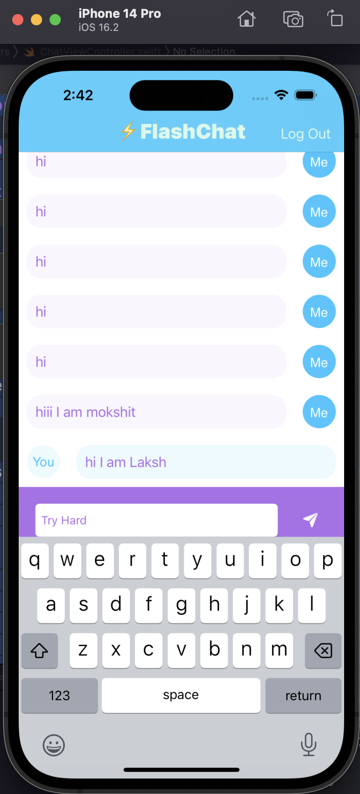
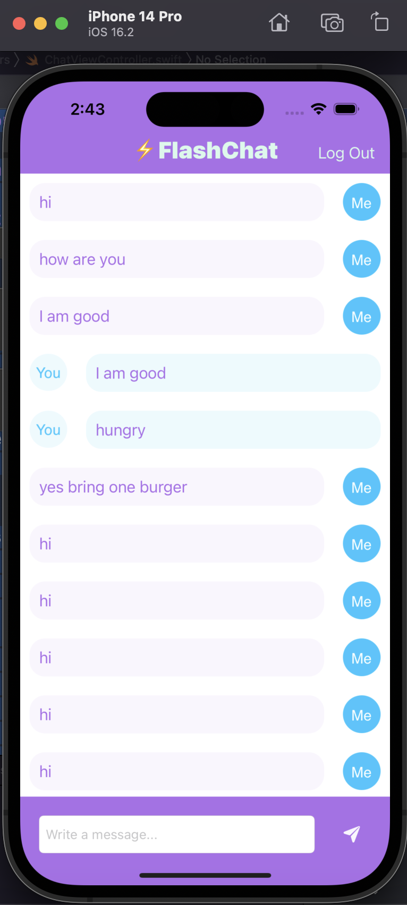

# Flash-Chat
Flash Chat is an internet based messaging app similar to WhatsApp, the popular messaging app that was bought by Facebook for $22 billion. I have used a service called Firebase Firestore as a backend database to store and retrieve our messages from the cloud. 

